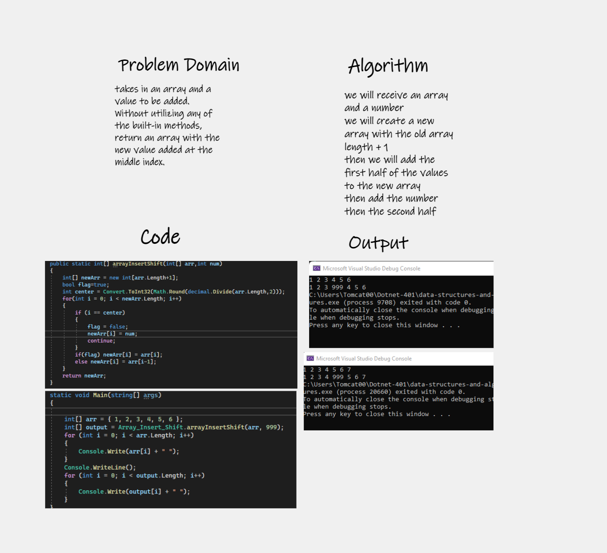

# Insert to Middle of an Array
Takes in an array and a value to be added. Without utilizing any of the built-in methods, return an array with the new value added at the middle index.

## Whiteboard Process

