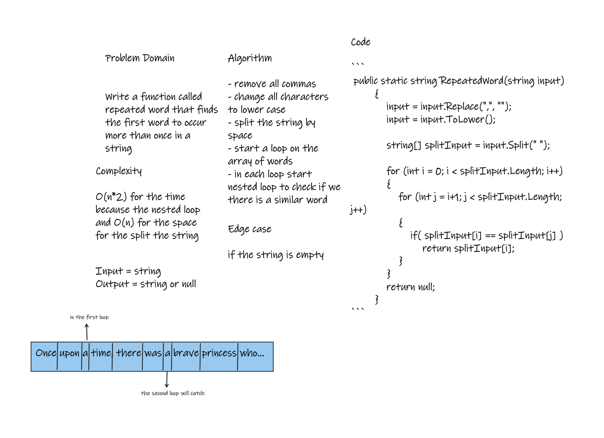

# Challenge Summary
Write a function called repeated word that finds the first word to occur more than once in a string

## Whiteboard Process


## Approach & Efficiency
Complexity : O(n*2) for the time because the nested loop
and O(n) for the space for the split the string 

## Solution
```
 public static string RepeatedWord(string input)
        {
            input = input.Replace(",", "");
            input = input.ToLower();
            
            string[] splitInput = input.Split(" ");

            for (int i = 0; i < splitInput.Length; i++)
            {
                for (int j = i+1; j < splitInput.Length; j++)
                {
                    if( splitInput[i] == splitInput[j] )
                        return splitInput[i];
                }
            }
            return null;    
        }
```