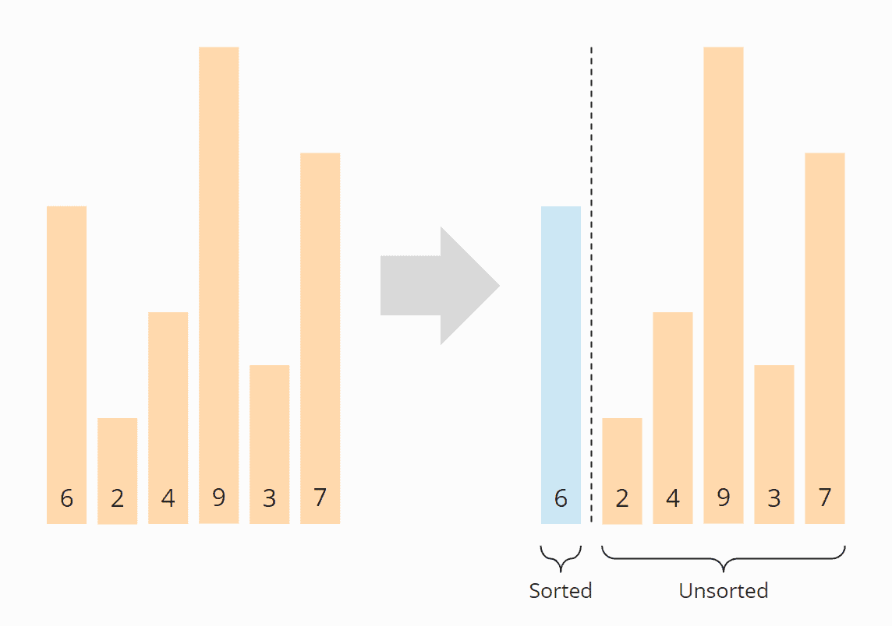
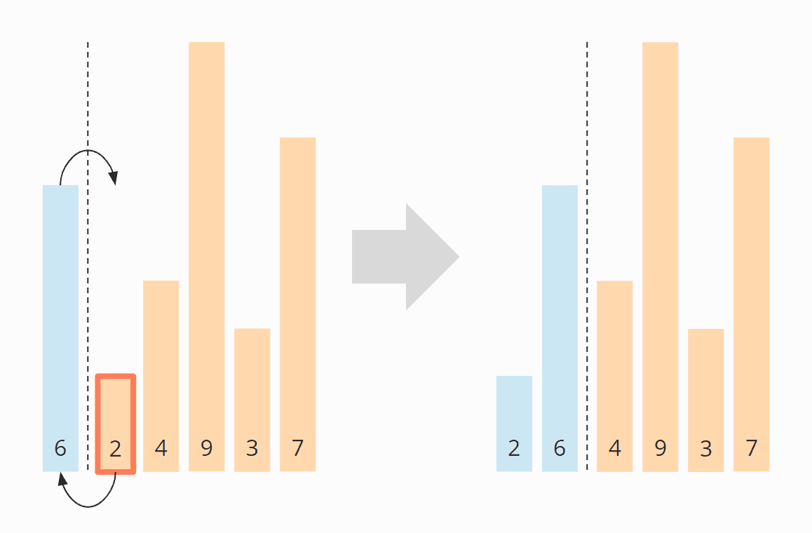
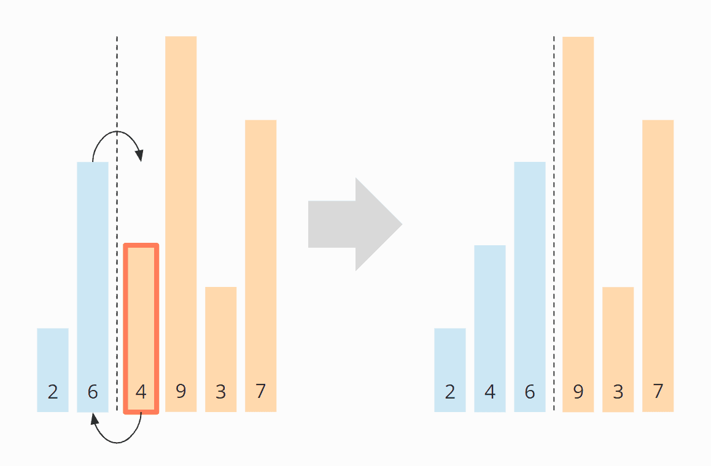
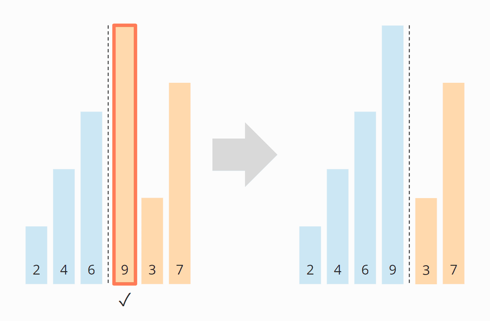
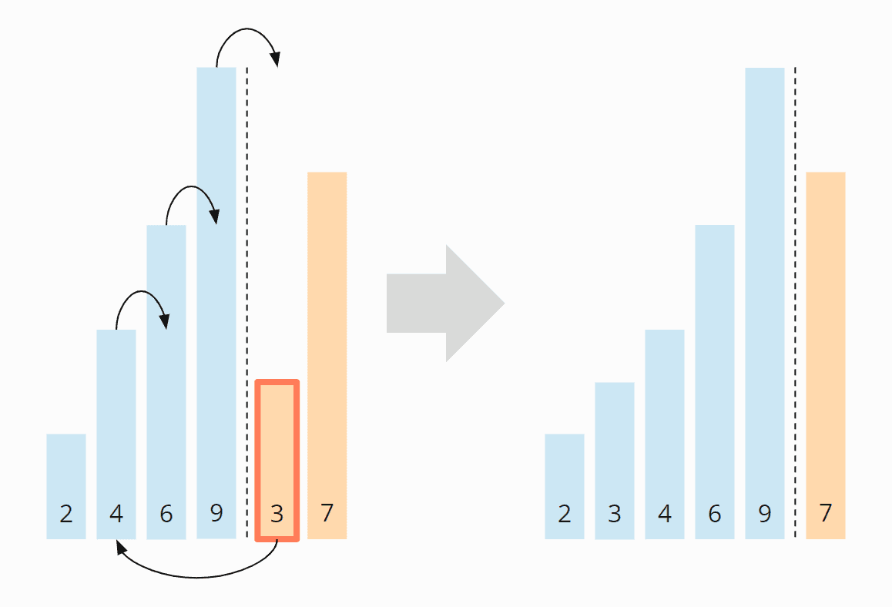
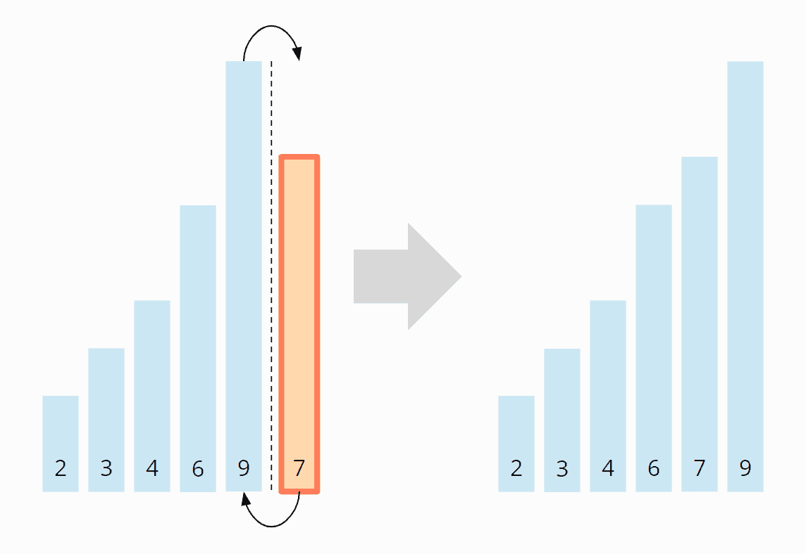

# Insertion sort
---
## Introduction
Insertion sort is a simple sorting algorithm that works similar to the way you sort playing cards in your hands. The array is virtually split into a sorted and an unsorted part. Values from the unsorted part are picked and placed at the correct position in the sorted part.

## Pseudo Code:

```
 InsertionSort(int[] arr)

    FOR i = 1 to arr.length

      int j <-- i - 1
      int temp <-- arr[i]

      WHILE j >= 0 AND temp < arr[j]
        arr[j + 1] <-- arr[j]
        j <-- j - 1

      arr[j + 1] <-- temp
```

---
## Code in C#:

```
public static void Insertion_Sort(int[] arr)
        {
            int n = arr.Length;
            for (int i = 1; i < n; i++)
            {
                int j = i - 1;
                int temp = arr[i];

                while (j >= 0 && arr[j] > temp)
                {
                    arr[j + 1] = arr[j];
                    j--;
                }
                arr[j + 1] = temp;
            }
        }
```

---
## Space & Time Complexity:
The two nested loops are an indication that we are dealing with quadratic effort, meaning with time complexity of O(n²)*. This is the case if both the outer and the inner loop count up to a value that increases linearly with the number of elements.
---

## Example:

### Step 1
First, we divide the array into a left, sorted part, and a right, unsorted part. The sorted part already contains the first element at the beginning, because an array with a single element can always be considered sorted.


### Step 2
Then we look at the first element of the unsorted area and check where, in the sorted area, it needs to be inserted by comparing it with its left neighbor.

In the example, the 2 is smaller than the 6, so it belongs to its left. In order to make room, we move the 6 one position to the right and then place the 2 on the empty field. Then we move the border between sorted and unsorted area one step to the right:

### Step 3
We look again at the first element of the unsorted area, the 4. It is smaller than the 6, but not smaller than the 2 and, therefore, belongs between the 2 and the 6. So we move the 6 again one position to the right and place the 4 on the vacant field:

### Step 4
The next element to be sorted is the 9, which is larger than its left neighbor 6, and thus larger than all elements in the sorted area. Therefore, it is already in the correct position, so we do not need to shift any element in this step:

### Step 5
The next element is the 3, which is smaller than the 9, the 6 and the 4, but greater than the 2. So we move the 9, 6 and 4 one position to the right and then put the 3 where the 4 was before:

### Step 6
That leaves the 7 – it is smaller than the 9, but larger than the 6, so we move the 9 one field to the right and place the 7 on the vacant position:
