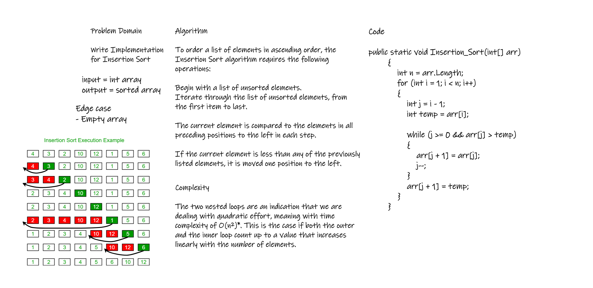

# Challenge Summary
Insertion sort is a simple sorting algorithm that works similar to the way you sort playing cards in your hands. The array is virtually split into a sorted and an unsorted part. Values from the unsorted part are picked and placed at the correct position in the sorted part.
## Whiteboard Process


## Approach & Efficiency
The two nested loops are an indication that we are dealing with quadratic effort, meaning with time complexity of O(n²)*. This is the case if both the outer and the inner loop count up to a value that increases linearly with the number of elements.

## Solution
```
public static void Insertion_Sort(int[] arr)
        {
            int n = arr.Length;
            for (int i = 1; i < n; i++)
            {
                int j = i - 1;
                int temp = arr[i];

                while (j >= 0 && arr[j] > temp)
                {
                    arr[j + 1] = arr[j];
                    j--;
                }
                arr[j + 1] = temp;
            }
        }
```