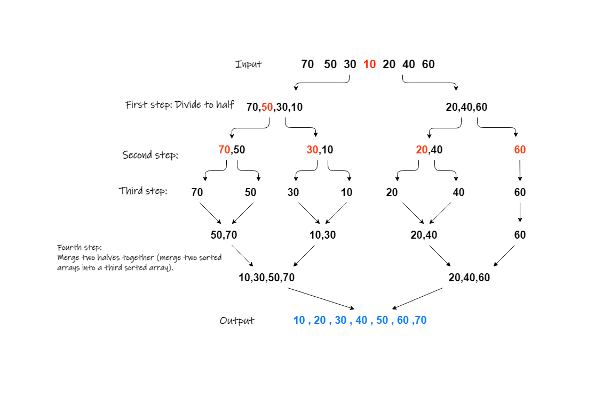

# Merge sort


## Introduction
Merge Sort is a Divide and Conquer algorithm. It divides the input array into two halves, calls itself for the two halves, and then it merges the two sorted halves.

## Pseudo Code:
```
ALGORITHM Mergesort(arr)
    DECLARE n <-- arr.length

    if n > 1
      DECLARE mid <-- n/2
      DECLARE left <-- arr[0...mid]
      DECLARE right <-- arr[mid...n]
      // sort the left side
      Mergesort(left)
      // sort the right side
      Mergesort(right)
      // merge the sorted left and right sides together
      Merge(left, right, arr)

ALGORITHM Merge(left, right, arr)
    DECLARE i <-- 0
    DECLARE j <-- 0
    DECLARE k <-- 0

    while i < left.length && j < right.length
        if left[i] <= right[j]
            arr[k] <-- left[i]
            i <-- i + 1
        else
            arr[k] <-- right[j]
            j <-- j + 1

        k <-- k + 1

    if i = left.length
       set remaining entries in arr to remaining values in right
    else
       set remaining entries in arr to remaining values in left
```

## Merge Sort Time and Space Complexity

1. Space Complexity
Auxiliary Space: O(n)
Sorting In Place: No
Algorithm : Divide and Conquer

2. Time Complexity

    Merge Sort is a recursive algorithm and time complexity can be expressed as following recurrence relation.

    T(n) = 2T(n/2) + O(n)

    The solution of the above recurrence is O(nLogn). The list of size N is divided into a max of Logn parts, and the merging of all sublists into a single list takes O(N) time, the worst-case run time of this algorithm is O(nLogn)

    Best Case Time Complexity: O(n*log n)

    Worst Case Time Complexity: O(n*log n)

    Average Time Complexity: O(n*log n)

The time complexity of MergeSort is O(n*Log n) in all the 3 cases (worst, average and best) as the mergesort always divides the array into two halves and takes linear time to merge two halves.

## Example
