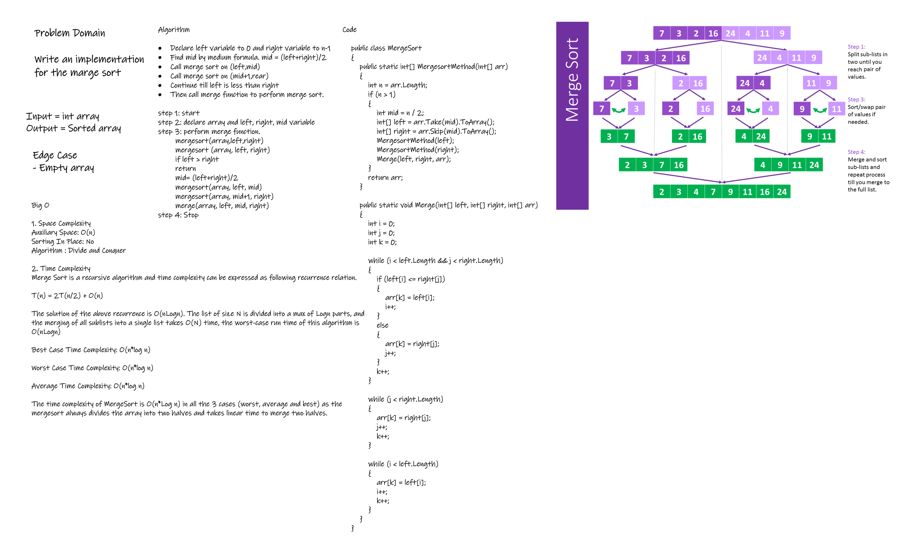

# Challenge Summary
Implementation of Merge Sort.

- Provide a visual step through for each of the sample arrays based on the provided pseudo code.
- Convert the pseudo-code into working code in your language.
- Present a complete set of working tests


## Whiteboard Process

## Approach & Efficiency
1. Space Complexity
Auxiliary Space: O(n)
Sorting In Place: No
Algorithm : Divide and Conquer

2. Time Complexity
Merge Sort is a recursive algorithm and time complexity can be expressed as following recurrence relation.

T(n) = 2T(n/2) + O(n)

The solution of the above recurrence is O(nLogn). The list of size N is divided into a max of Logn parts, and the merging of all sublists into a single list takes O(N) time, the worst-case run time of this algorithm is O(nLogn)

Best Case Time Complexity: O(n*log n)

Worst Case Time Complexity: O(n*log n)

Average Time Complexity: O(n*log n)

The time complexity of MergeSort is O(n*Log n) in all the 3 cases (worst, average and best) as the mergesort always divides the array into two halves and takes linear time to merge two halves.


## Solution
```
    public class MergeSort
    {
        public static int[] MergesortMethod(int[] arr)
        {
            int n = arr.Length;
            if (n > 1)
            {
                int mid = n / 2;
                int[] left = arr.Take(mid).ToArray();
                int[] right = arr.Skip(mid).ToArray();
                MergesortMethod(left);
                MergesortMethod(right);
                Merge(left, right, arr);
            }
            return arr;
        }

        public static void Merge(int[] left, int[] right, int[] arr)
        {
            int i = 0;
            int j = 0;
            int k = 0;

            while (i < left.Length && j < right.Length)
            {
                if (left[i] <= right[j])
                {
                    arr[k] = left[i];
                    i++;
                }
                else
                {
                    arr[k] = right[j];
                    j++;
                }
                k++;
            }

            while (j < right.Length)
            {
                arr[k] = right[j];
                j++;
                k++;
            }

            while (i < left.Length)
            {
                arr[k] = left[i];
                i++;
                k++;
            }
        }
    }
```
