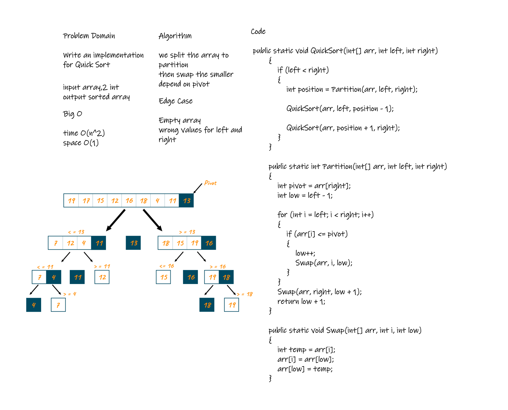

# Challenge Summary
Review the pseudocode below, then trace the algorithm by stepping through the process with the provided sample array. Document your explanation by creating a blog article that shows the step-by-step output after each iteration through some sort of visual.

## Whiteboard Process

## Approach & Efficiency
Time: O(n^2)

Space: O(1)
## Solution
                                   
    public static void QuickSort(int[] arr, int left, int right)
        {
            if (left < right)
            {
                int position = Partition(arr, left, right);
                QuickSort(arr, left, position - 1);

                QuickSort(arr, position + 1, right);
            }
        }

        public static int Partition(int[] arr, int left, int right)
        {
            int pivot = arr[right];
            int low = left - 1;

            for (int i = left; i < right; i++)
            {
                if (arr[i] <= pivot)
                {
                    low++;
                    Swap(arr, i, low);
                }
            }
            Swap(arr, right, low + 1);
            return low + 1;
        }

        public static void Swap(int[] arr, int i, int low)
        {
            int temp = arr[i];
            arr[i] = arr[low];
            arr[low] = temp;
        }
