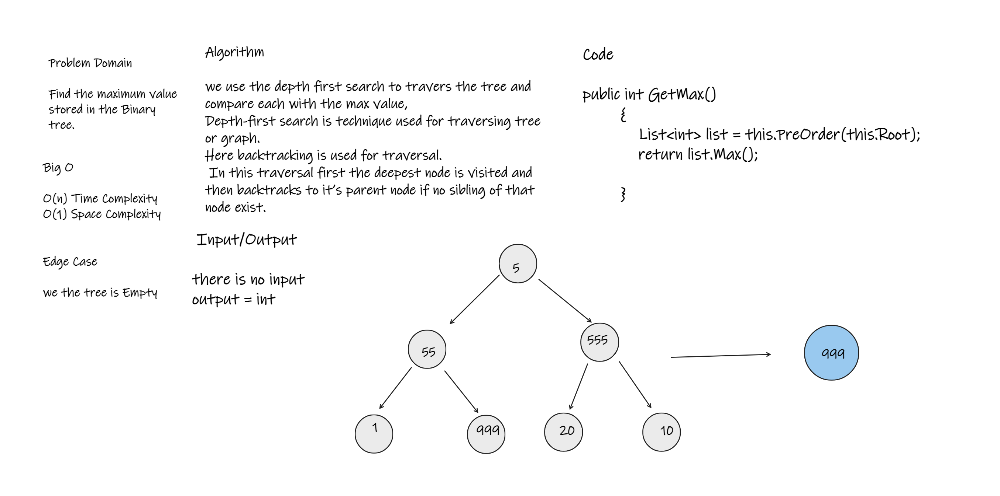

# Challenge Summary
Find the maximum value stored in the tree.

## Whiteboard Process

## Approach & Efficiency
this method take O(n) time complexity and O(1) Space

## Solution
open the sln file click RUN 

 
            

        public int GetMax(Node Root)
            {

            if (this.Root == Root) max = Root.Data;

            if (Root.Left != null)
                GetMax(Root.Left);

            if (Root.Right != null)
                GetMax(Root.Right);

            if (Root.Data > max) max = Root.Data;
            return max;
        }
