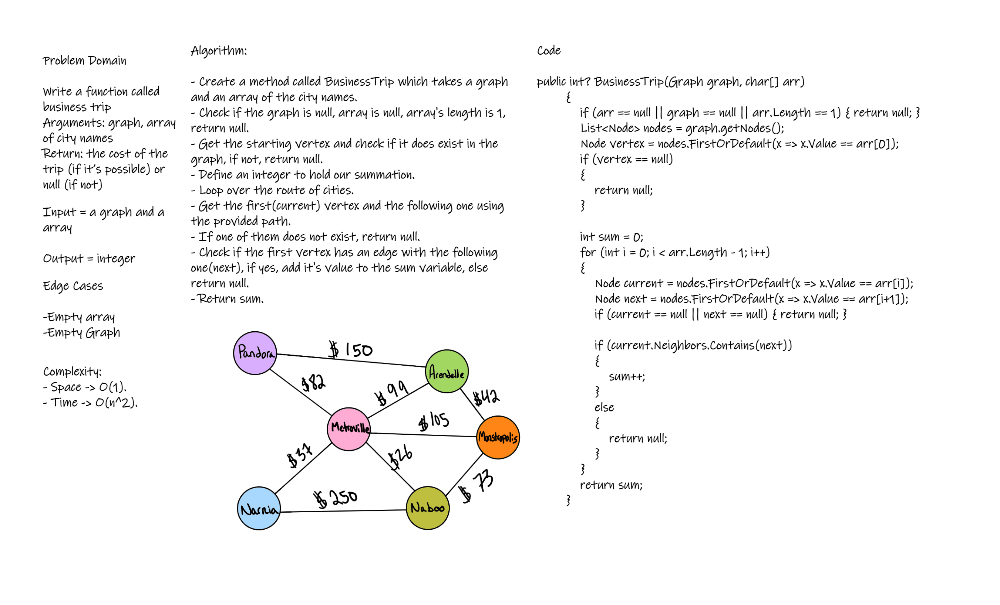

# Challenge Summary
Write a function called business trip that takes a graph, and array of city names. The function should return the cost of the trip (if it’s possible) or null (if not).

## Whiteboard Process

## Approach & Efficiency
Algorithm:
- Create a method called BusinessTrip which takes a graph and an array of the city names.
- Check if the graph is null, array is null, array's length is 1, return null.
- Get the starting vertex and check if it does exist in the graph, if not, return null.
- Define an integer to hold our summation.
- Loop over the route of cities.
- Get the first(current) vertex and the following one using the provided path.
- If one of them does not exist, return null.
- Check if the first vertex has an edge with the following one(next), if yes, add it's value to the sum variable, else return null.
- Return sum.

Complexity:
- Space -> O(1).
- Time -> O(n^2).

## Solution
```
   public int? BusinessTrip(Graph graph, char[] arr)
        {
            if (arr == null || graph == null || arr.Length == 1) { return null; }
            List<Node> nodes = graph.getNodes();
            Node vertex = nodes.FirstOrDefault(x => x.Value == arr[0]);
            if (vertex == null)
            {
                return null;
            }

            int sum = 0;
            for (int i = 0; i < arr.Length - 1; i++)
            {
                Node current = nodes.FirstOrDefault(x => x.Value == arr[i]);
                Node next = nodes.FirstOrDefault(x => x.Value == arr[i+1]);
                if (current == null || next == null) { return null; }
                
                if (current.Neighbors.Contains(next))
                {
                    sum++; 
                }
                else
                {
                    return null;
                }
            }
            return sum;
        }
```