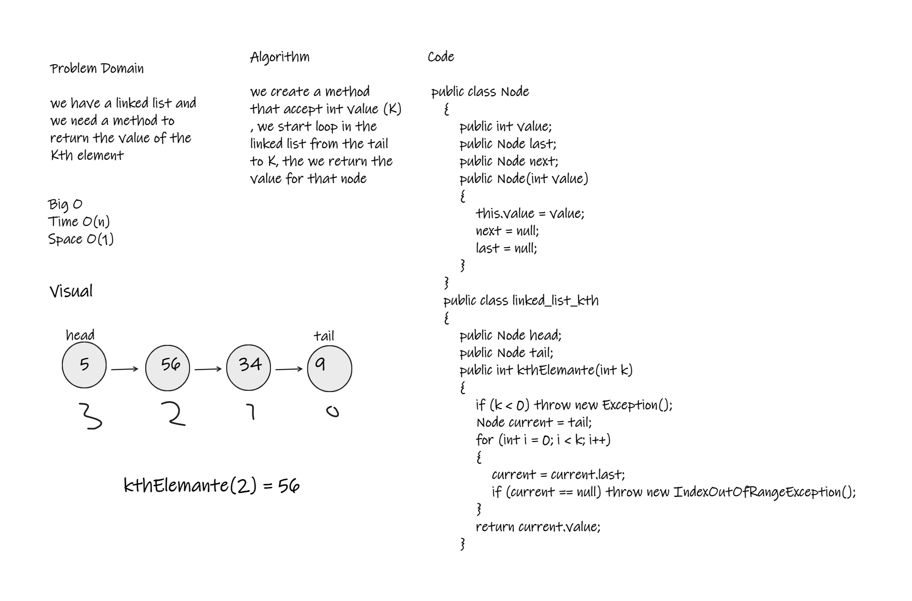

# Challenge Summary
we have a linked list and we need a method to return the value of the Kth element 

## Whiteboard Process

## Approach & Efficiency
This Code contain one method "KthElemant" this method time complexity is O(n) and space complexity is O(1)

## Solution
kthElemant from end
argument: a number, k, as a parameter.
Return the node’s value that is k places from the tail of the linked list.
You have access to the Node class and all the properties on the Linked List class as well as the methods created in previous challenges.