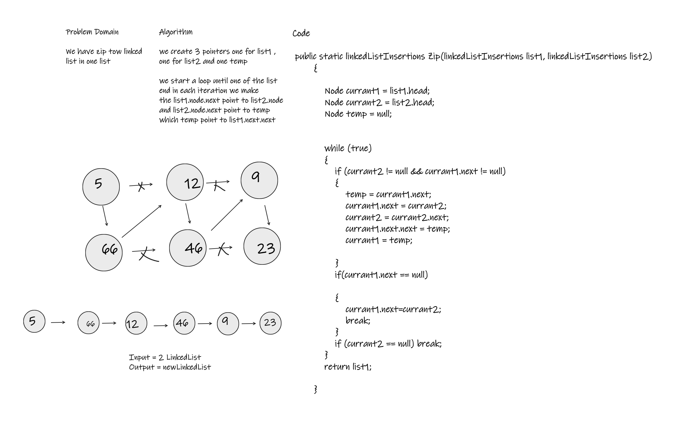

# Challenge Summary
Create a method that takes two Linked-lists and zip them into one list, then return the new zipped one.

## Whiteboard Process

## Approach & Efficiency
The time Complexite Complexite is Big O(n)
The space Complexite is Big O(1)

## Solution
run the solution file and running the Program.cs 

        public static linkedListInsertions Zip(linkedListInsertions list1, linkedListInsertions list2)
        {

            Node currant1 = list1.head;
            Node currant2 = list2.head;
            Node temp = null;

            while (true)
            {
                if (currant2 != null && currant1.next != null)
                {
                    temp = currant1.next;
                    currant1.next = currant2;
                    currant2 = currant2.next;
                    currant1.next.next = temp;
                    currant1 = temp;
                    
                }
                if(currant1.next == null) 

                {
                    currant1.next=currant2;
                    break;
                }
                if (currant2 == null) break;
            }
            return list1;

        } 
    
