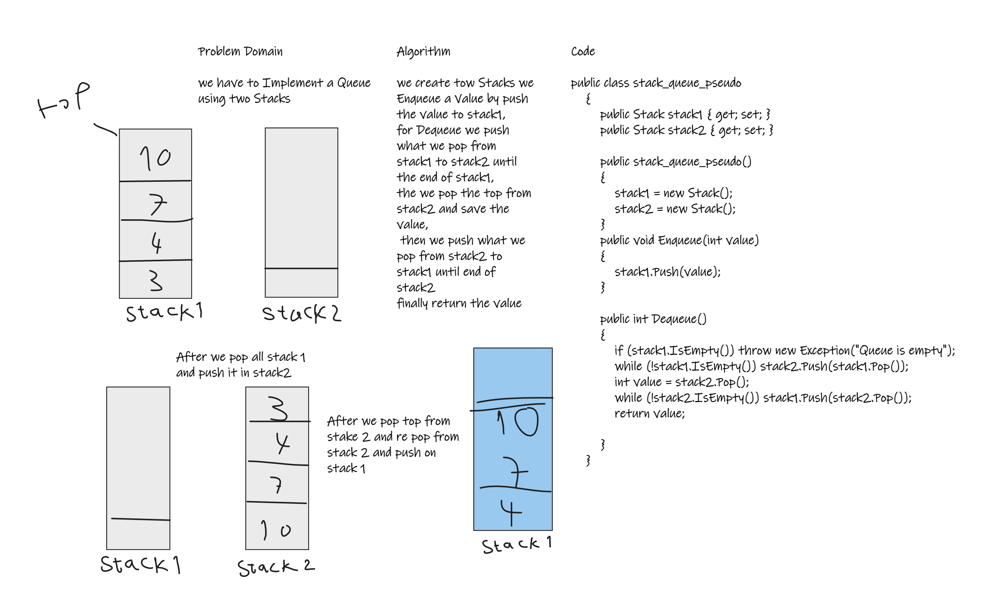

# Challenge Summary
## Pseudo Queue
Implement a Queue using two Stacks

## Whiteboard Process

 
## Approach & Efficiency
The Enqueue method Complexite is O(1) Space and Time
The Dequeue method Complexite is O(1) Space and O(n) Time

## Solution
Running Program.cs file

    public class stack_queue_pseudo
    {
        public Stack stack1 { get; set; }
        public Stack stack2 { get; set; }

        public stack_queue_pseudo()
        {
            stack1 = new Stack();
            stack2 = new Stack();
        }
        public void Enqueue(int value)
        {
            stack1.Push(value);
        }

        public int Dequeue()
        {
            if (stack1.IsEmpty()) throw new Exception("Queue is empty");
            while (!stack1.IsEmpty()) stack2.Push(stack1.Pop());
            int value = stack2.Pop();
            while (!stack2.IsEmpty()) stack1.Push(stack2.Pop());
            return value;

        }
    }