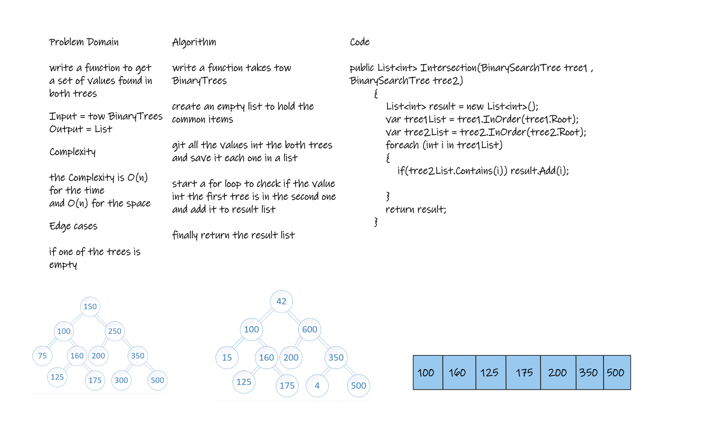

# Challenge Summary
Write a function called tree_intersection that takes two binary trees as parameters.

## Whiteboard Process


## Approach & Efficiency
the Complexity is O(n) for the time 
and O(n) for the space

## Solution
```
public List<int> Intersection(BinarySearchTree tree1 , BinarySearchTree tree2)
        {
            List<int> result = new List<int>();
            var tree1List = tree1.InOrder(tree1.Root);
            var tree2List = tree2.InOrder(tree2.Root);
            foreach (int i in tree1List)
            {
                if(tree2List.Contains(i)) result.Add(i);
                
            }
            return result;
        }
```
